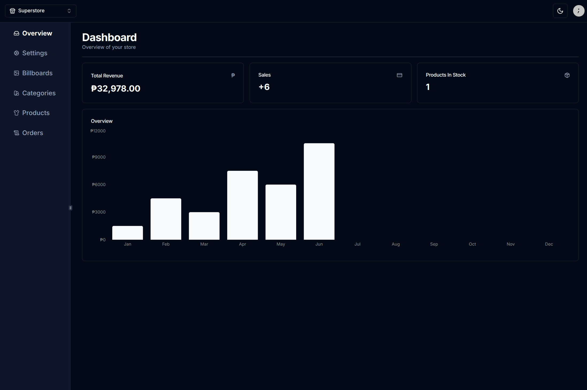
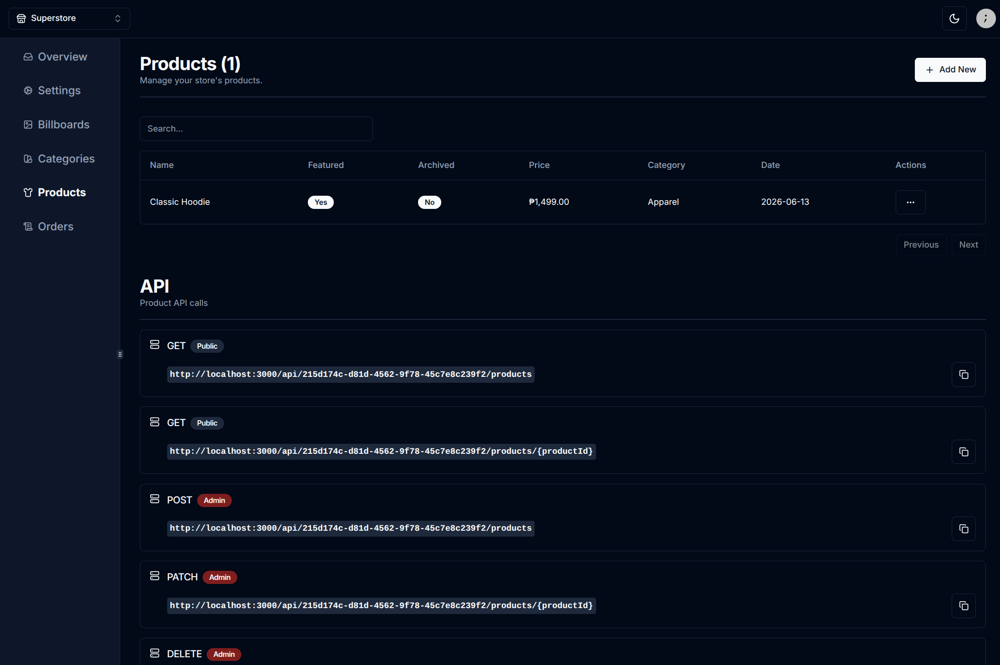
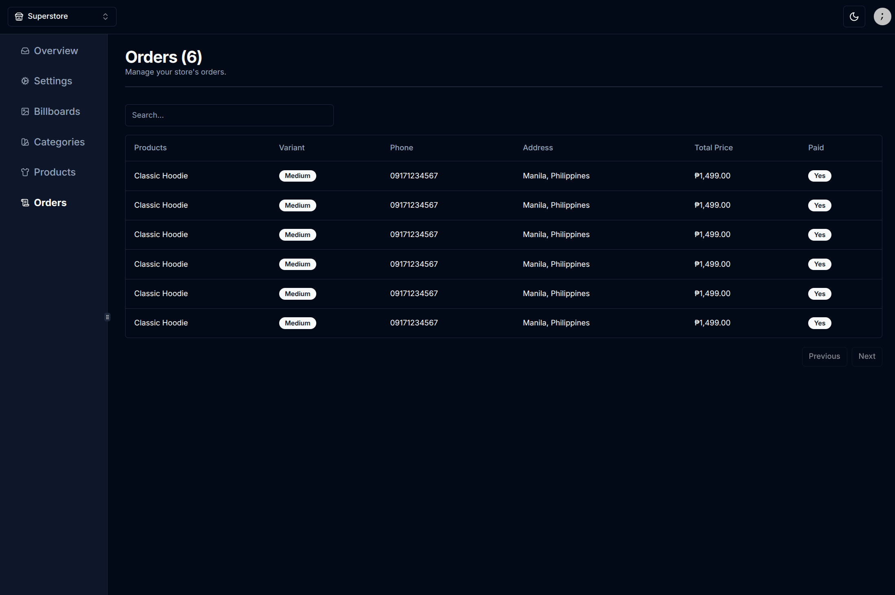

# Better Ecommerce Admin

Admin dashboard for managing ecommerce stores, billboards, categories, products,
variants, orders, and sales metrics.

## Quick Commands

Daily development:

```bash
docker compose up --build
```

Production-like local test:

```bash
docker compose -f compose.prod.yaml up --build
```

Stop development:

```bash
docker compose down
```

Stop production:

```bash
docker compose -f compose.prod.yaml down
```

Use `docker compose up` while coding. Use the production command only when
testing the optimized image before deployment.

## Screenshots





## Stack

- Next.js 14 App Router, React 18, and TypeScript
- Tailwind CSS and shadcn/ui components
- Clerk authentication
- Prisma ORM with MySQL
- Cloudinary image uploads
- PayMongo checkout integration
- Multi-stage Docker builds for development and production
- Docker Compose for local development and production-like testing

## Prerequisites

- Docker with Docker Compose
- A Clerk development application
- Optional: Cloudinary account for image uploads
- Optional: PayMongo test account for checkout

## Clerk Setup

Clerk is required because stores are owned by Clerk user IDs and all dashboard
routes are protected.

1. Create a development application in the Clerk dashboard.
2. Open **API Keys** and copy the publishable and secret keys.
3. Put them in `.env` as `NEXT_PUBLIC_CLERK_PUBLISHABLE_KEY` and
   `CLERK_SECRET_KEY`.
4. Keep the included `/sign-in` and `/sign-up` URLs. Clerk development
   instances support localhost.

## Development With Docker

```bash
cp .env.example .env
```

Fill in the two required Clerk keys, then run:

```bash
docker compose up --build
```

This selects the Dockerfile's `development` target, bind-mounts the source code,
and runs `next dev` with hot reload.

If Docker reports permission denied for `/var/run/docker.sock`, add your user to
the Docker group, then log out and back in:

```bash
sudo usermod -aG docker "$USER"
```

Open <http://localhost:3000>. Sign up or sign in, then create your first store
when prompted.

The Compose stack starts:

- Admin app: <http://localhost:3000>
- MySQL: `localhost:3306`

Prisma migrations run automatically when the app container starts.

Stop the stack with:

```bash
docker compose down
```

To also remove local database data:

```bash
docker compose down -v
```

## Production With Docker

The same Dockerfile also contains a minimal `production` target. It builds
Next.js standalone output and runs `node server.js` as a non-root user.

To build and run the production stack locally:

```bash
docker compose -f compose.prod.yaml up --build
```

Open <http://localhost:3000>.

After the app starts, sign in and create or select a store. To seed demo data
into the production-like database, run this from another terminal:

```bash
docker compose -f compose.prod.yaml run --rm migrate sh -c "npx prisma generate && npm run db:seed"
```

The production-like stack uses its own `mysql_prod_data` volume, so data seeded
through the development Compose stack will not appear here. If you need to seed
data for a specific Clerk user, pass `SEED_CLERK_USER_ID`:

```bash
docker compose -f compose.prod.yaml run --rm -e SEED_CLERK_USER_ID="user_xxx" migrate sh -c "npx prisma generate && npm run db:seed"
```

The production Compose stack:

- Builds an immutable production image without source bind mounts.
- Runs `prisma migrate deploy` in a one-shot migration container.
- Starts the app only after migrations succeed.
- Keeps MySQL private to the Compose network.
- Persists production-test data in a separate Docker volume.
- Restarts the app and database after unexpected exits.

Stop the production stack with:

```bash
docker compose -f compose.prod.yaml down
```

Remove its local database data with:

```bash
docker compose -f compose.prod.yaml down -v
```

For a real deployment, replace the included MySQL service with a managed
database or a backed-up database host. Supply production Clerk credentials,
HTTPS payment redirect URLs, and all secrets through the deployment platform.

## Docker Targets

| Target | Purpose | Process |
| --- | --- | --- |
| `development` | Daily local development | `next dev` |
| `builder` | Compile the standalone Next.js app | `next build` |
| `migration` | Apply committed Prisma migrations | `prisma migrate deploy` |
| `production` | Minimal runtime image | `node server.js` |

## Optional Demo Data

The app does not require seed data; after signing in, it can create an empty
store through the UI. For a populated local dashboard:

1. Sign in and create a store.
2. Run:

```bash
docker compose run --rm app npm run db:seed
```

The seed uses the first existing store by default. Set `SEED_CLERK_USER_ID` to
target a specific user's store. It is idempotent and creates demo catalog data
plus six months of paid orders for the revenue graph.

## Run Without the App Container

Use Node.js 20. Start only MySQL with Docker:

```bash
cp .env.example .env
docker compose up -d db
npm ci
npm run db:generate
npm run db:deploy
npm run dev
```

Open <http://localhost:3000>.

## Environment Variables

Required:

| Variable | Purpose |
| --- | --- |
| `NEXT_PUBLIC_CLERK_PUBLISHABLE_KEY` | Clerk browser key |
| `CLERK_SECRET_KEY` | Clerk server key |
| `DATABASE_URL` | MySQL connection used outside Compose |

Optional:

| Variable | Purpose |
| --- | --- |
| `NEXT_PUBLIC_CLOUDINARY_CLOUD_NAME` | Cloudinary cloud name |
| `NEXT_PUBLIC_CLOUDINARY_UPLOAD_PRESET` | Unsigned upload preset |
| `PAYMONGO_SECRET_KEY` | PayMongo test secret key |
| `PAYMENT_REDIRECT_SUCCESS` | Successful checkout redirect |
| `PAYMENT_REDIRECT_CANCELED` | Canceled checkout redirect |
| `SEED_CLERK_USER_ID` | Owner of optional demo data |

See `.env.example` for the complete local configuration.

## Database Commands

```bash
npm run db:generate
npm run db:migrate -- --name migration_name
npm run db:deploy
npm run db:seed
npm run db:studio
```

## Known Limitations

- Clerk keys are required even for local development.
- Image upload is disabled until Cloudinary is configured. Products and
  billboards can still be created without images for local development.
- Checkout is unavailable until PayMongo is configured.
- The PayMongo webhook endpoint does not yet verify webhook signatures.
